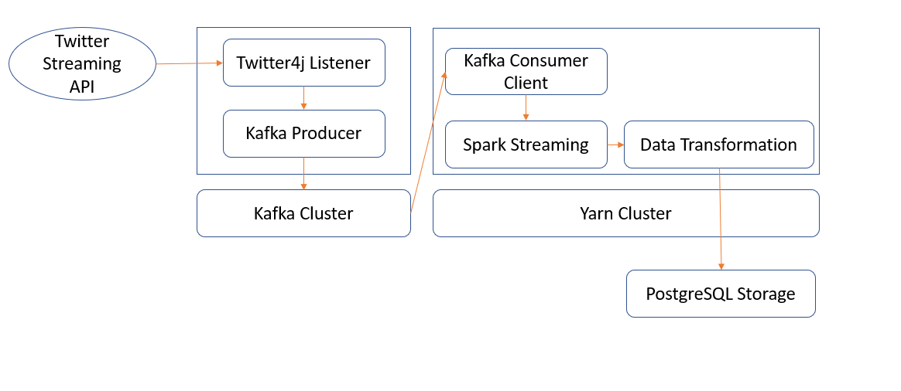

# Introduction

This document describes the proof of contept (PoC) design for the application to stream Twitter status, apply simple data transformations and load the result into a database. Following is the overview of the steps to build this application.
* Step 1: Create Twitter developer account and create an application to generate credentials to use Twitter Streaming API.
* Step 2: [Docker-compose](https://docs.docker.com/compose/) setup to integrate docker images for [Apache Kafka](https://hub.docker.com/r/bitnami/Kafka), [Apache Spark](https://github.com/gettyimages/docker-spark) and [PostgreSQL](https://hub.docker.com/r/bitnami/postgresql).
* Step 3: [Twitter developer](https://developer.Twitter.com/en.html) account and a streaming listener setup to stream status and a Kafka producer to publish them across Kafka cluster.
* Step 4: [Apache Spark streaming API](https://spark.apache.org/docs/2.1.0/streaming-Kafka-integration.html) setup to consume the Twitter status published in previous step.


# Prerequisites

* This document provides instructions based on WinPutty utility installed on Windows 10 or command shell of any Unix distribution.
* Docker-machine or Docker desktop (Windows 10) installed and configured to use host OS disk.
* Java (1.8) and Scala (2.11.8) installed.


# How to install?

Download the Docker_Kafka_Spark/docker-compose.yml.
Download the Docker_Kafka_Spark/Docker_Kafka_Spark/out/artifacts/Docker_Kafka_Spark.jar.
Start the Docker containers.
```bash
docker-compose up
```
Get the Docker container id of the Spark master and Spark worker nodes.
```bash
docker ps
```
Copy the jar file Docker_Kafka_Spark/Docker_Kafka_Spark/out/artifacts/Docker_Kafka_Spark.jar to the Spark containers.
NOTE: Later, we will build a Docker image to automate the file transfer and execution of the streaming application.
```bash
docker cp ./Docker_Kafka_Spark/out/artifacts/Docker_Kafka_Spark.jar <Spark container id>:/opt/Docker_Kafka_Spark.jar
```
Start the Spark Docker container shell and execute the spark application jar.
```bash
winpty docker exec -it kpmg_master_1 bash
spark-submit --class MyExecutor --deploy-mode client --driver-memory 1g --executor-memory 1g --executor-cores 1 /opt/Docker_Kafka_Spark.jar <Consumer Key> <Consumer Secret> <Access Token> <Access Secret>
```

# How to verify the installation?

Create a new Kafka topic. (Ignore the winpty command prefix if you are on unix.)
```bash
winpty docker exec -it kpmg_Kafka_1 Kafka-topics.sh --create --zookeeper kpmg_zookeeper_1:2181 --replication-factor 1 --partitions 1 --topic mytopic
```
List and verify the newly created Kafka topic.
```bash
winpty docker exec -it kpmg_Kafka_1 Kafka-topics.sh --list --zookeeper kpmg_zookeeper_1
```
Create a Kafka producer (Preferably in a new command shell).
```bash
winpty docker exec -it kpmg_Kafka_1 Kafka-console-producer.sh --broker-list kpmg_Kafka_1:9092 --topic mytopic
```
Create a Kafka consumer.
```bash
winpty docker exec -it kpmg_Kafka_1 Kafka-console-consumer.sh --bootstrap-server kpmg_Kafka_1:9092 --topic mytopic --from-beginning
```
Give some text inputs in the producer shell and see if you can verify them in the consumer shell.
Connect to PostgreSQL container and verify the access using psql.
```bash
winpty docker exec -it kpmg_postgresql_1 bash
psql -U postgresql
\c my_database
\dt
```

# Design

This proof-of-concept application has been created for learning purposes. There are number of steps to deploy it into a production environment. To get started faster, I intentionally have used docker container images for Kafka, Spark and PostgreSQL that are already available. As a result, we are dependent on the version of the frameworks and installation configuration that are available out of the box.

Now that we have made ourselves familiar with motivation and constraints, let's understand more about the goal, the basic design and the principles. Our goal is to build a publish & subscribe (pub/sub) system in an automated fashion that can allow us to collect and distribute the streaming data between sources and down-stream systems. So, our first principle is to assume that any component could potentially be replaced or be removed from the architecture. For example, Apache Spark can be replaced with Apache Flink, PostgreSQL could be replaced with MongoDB or Yarn could be replaced with Mesos.

Based on the high-level diagram from the following image, one could infer that there are three different stages: Source Sink(Twitter Publisher), Collect and Process(Kafka and Spark) and Store (RDBMS). 



We are using Twitter4J library to get data from Twitter streaming API. Before we make any decision on the data we are collecting, it is important to notice that we are only collecting a fraction of the total Twitter status generated (firehose). Twitter streaming API also has some rate limits but for now they are handled gracefully by Twitter4J library.

Twitter4J has a streaming listener, ```StatusListener```, that will call the ```onStatus``` method upon receiving a new status.
```scala
def onStatus(status: Status): Unit = {
val TwitterStatus =
          TwitterStatus(
            ...
          )

        KafkaProducer.send(new ProducerRecord[String, String](Kafka_TOPIC, TwitterStatus.userName, statusJson))
		...
}
```
For now, we are only collecting handful of attributes from the status. We will convert the parameters, translate them into JSON format and send it to the Kafka producer. We could also add more Twitter listeners to redirect data to multiple Kafka brokers if the (non)functional requiements demand it. Since we are using network interface bridge within our ```docker-compose.yml```, we are able to access other containers using their name as the hostname.

Once we have published the incoming messages, we are now able to consume these messages through the Kafka cluster. Now, we can set configuration details on how to consume these messages from the Kafka using the Spark-Kafka-Streaming client. Spark streaming uses a micro-batch architecture, so we will set a batch interval of 20 seconds. The batch interval is a choice without performing extensive testing, but keep in mind that it has implications on our data transformation logic which we will cover in a moment.
```scala
def startSparkStreaming(): Unit = {
	...
    val KafkaParams = Map[String, Object](
      "bootstrap.servers" -> Kafka_HOST,
      "key.deserializer" -> classOf[StringDeserializer],
      "value.deserializer" -> classOf[StringDeserializer],
      "group.id" -> "my_group_id",
      "auto.offset.reset" -> "latest",
      "enable.auto.commit" -> (false: java.lang.Boolean)
    )
	...
}
```
There is also a way to directly stream Twitter data into Spark streaming without using Kafka but that defeats the purpose of learning the integration between these two frameworks.

To keep things simple, we are going to create a hypothetical data transformation on Twitter status that we are collecting. The goal is to understand, at any point in time, for a given period, what is the score of a status based on hashtag popularity. The hashtag_popularity is measured by the ```number of occurences``` and score is calculated based on ```total of (hashtag_popularity_n)```. For example, in the last 30 seconds, if there are 5 occurences of #Paris and 2 occurences of #Amsterdam and a status contains hashtags #Paris #Amsterdam #London then the score will be ```5+2+1 = 8```. Of course, experts would argue on whether this is the best way to rank a Twitter status or not!

We will also filter the incoming status with language 'en' (ISO 2 code for English).

```scala
...
    val hashtagAndCount =
      statuses
        .flatMap(_.hashTags)
        .map(ele => (ele, 1))
        .reduceByKey(_ + _)
        .cache()


    val usersAndHashtagCount =
      statuses
        .flatMap { status =>
          status
            .hashTags
            .map(hashtag => (hashtag, status))
        }

    usersAndHashtagCount
      .join(hashtagAndCount)
      .map { ele =>
        (ele._2._1, ele._2._2)
      }
      .reduceByKey(_ + _)
      .foreachRDD { rdd =>
        MyJdbcClient.loadTweets(rdd.collect().toList)
      }
...
```
Note the use of cache function on the hashtag rdd. We can change the order of the caching between ```usersAndHashtagCount``` and ```hashtagAndCount``` to improve the performance. Finally, we are collecting all the data from RDD and inserting them into PostgreSQL. For the sake of simplicity, you can think of RDD as chunks of data spread across spark cluster (specifically Yarn cluster in our case) and DStream is a logical collection of all these RDDs.

We can always create multiple mappings on DStream to carry out different analyses like the most trending keywords over different time windows(10s, 1m, 1hr) or the most trending and hated/loved discussions (sentiment analysis of a status and the count of retweet status id in reference to the original staus id) etc. For now, let's be happy with one analysis and move on to our next topic, the choice of a storage system.

We could have any of the other available options to store our data i.e. internal storage of Kafka, Of course we would need to implement high availability for Kafka cluster or HDFS through Spark or even better NoSql databases like MongoDB or Cassandra. Given our structure and nature of the source system (Twitter) MongoDB (flexible schema and adaptive to various types of applications) or HDFS(raw, efficient and cheap) could prove to be optimal choice, but we need to understand what other type of data we want to combine and what the down-stream systems will look like. To avoid finding out that we made a wrong choice in chosing the storage system, we will opt for storing in the widely used PostgreSQL database now.

# Next Steps

* Build our own Docker image to automate the installation process and manage the frameworks setup. For any new project, finding the right combinations of dependencies could be a huge challenge.
* Replace the storage layer with appropriate storage system MongoDB, HDFS etc.
* In terms of security, add SSL to network communications.
* Move the database configuration and credentials to an environment file.
* Add a module to manage resources of Yarn/Spark. Add auto commit, data check points and graceful recovery from node failures.
* Update network configurations in the Docker file. Also, enable remote access to the Spark and Kafka cluster.
* Add Jupyter or Zeplin to docker image to ease the data analysis process.
* Add unit tests and automate integration tests.
* Automate code build and deployment process to avoid losing sleep over production deployments.
* Other suggestions are welcome.